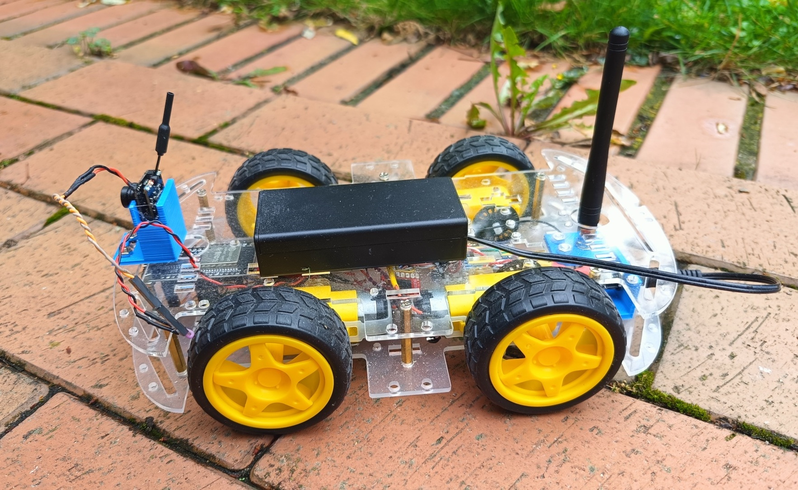
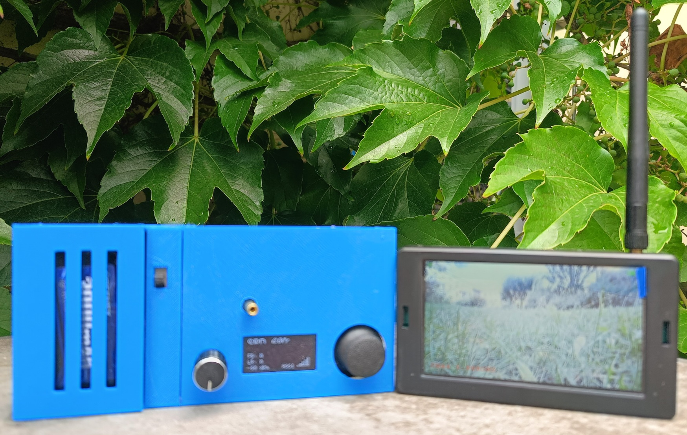

# ESP32 Autodrohne – LoRa-Steuerung und FPV

Ein selbstgebautes, drahtlos gesteuertes Fahrzeug auf Basis von ESP32.

Die Steuerung erfolgt über **LoRa mit 433 MHz**. Das Fahrzeug besitzt vier Antriebsmotoren, die über zwei Motorgruppen gesteuert werden. Ein Trackball im Steuerpult ermöglicht die proportionale Steuerung von Fahrtrichtung und Geschwindigkeit.

Zusätzlich ist auf dem Fahrzeug eine **FPV-Kamera** installiert. Das Kamerabild wird über eine separate **5,8-GHz-Funkverbindung** an einen FPV-Monitor übertragen, der direkt in das Steuerpult integriert ist.



---

## Projektübersicht

Das System besteht aus zwei voneinander getrennten Funkverbindungen.

```text
                         STEUERPULT
┌──────────────────────────────────────────────────┐
│                                                  │
│   ESP32-Steuerung                                │
│                                                  │
│   Trackball       Drehencoder       OLED         │
│      │                │               │          │
│      └────────────────┴───────────────┘          │
│                       │                          │
│                    LoRa 433 MHz                  │
│                       │                          │
│   ┌──────────────────────────────────────────┐   │
│   │          FPV-Monitor                     │   │
│   │          5,8-GHz-Empfänger               │   │
│   └──────────────────────────────────────────┘   │
│                                                  │
└──────────────────────┬───────────────────────────┘
                       │
                       │ LoRa 433 MHz
                       │ Steuerdaten
                       ▼
              ┌──────────────────┐
              │      AUTO        │
              │                  │
              │      ESP32       │
              │      LoRa        │
              │      DRV8833     │
              │      4 Motoren   │
              │                  │
              │   FPV-Kamera     │
              └────────┬─────────┘
                       │
                       │ 5,8 GHz
                       │ Video
                       ▼
                  FPV-Empfänger
                  im Steuerpult
```

---

# Funkverbindungen

Das Fahrzeug verwendet zwei voneinander getrennte Funkstrecken.

| System | Frequenz | Funktion          |
| ------ | -------: | ----------------- |
| LoRa   |  433 MHz | Fahrzeugsteuerung |
| FPV    |  5,8 GHz | Live-Videobild    |

Die LoRa-Verbindung wird ausschließlich für die Steuerdaten und die Rückmeldung der Signalstärke verwendet.

Die FPV-Verbindung überträgt das Kamerabild unabhängig von der Fahrzeugsteuerung.

---

# Steuerung

Die Steuerung erfolgt über einen analogen Trackball.

Der Trackball ermöglicht eine proportionale Steuerung:

* Vorwärts
* Rückwärts
* Links
* Rechts

Die beiden Achsen des Trackballs werden zunächst kalibriert.

Um kleine Schwankungen um die Mittelstellung zu unterdrücken, wird eine Totzone verwendet:

```cpp
#define DEADZONE 120
```

Damit bleibt das Fahrzeug bei nicht betätigtem Trackball stehen.

---

# Geschwindigkeitsregelung

Die maximale Geschwindigkeit wird über einen Drehencoder eingestellt.

Der Einstellbereich beträgt:

```text
0–100 %
```

Der aktuelle Geschwindigkeitswert wird auf dem OLED angezeigt.

Die eigentliche Motorleistung wird anschließend auf den PWM-Bereich des Motortreibers umgesetzt.

---

# OLED-Anzeige

Im Steuerpult befindet sich ein 128 × 64 Pixel OLED.

Angezeigt werden:

* Geschwindigkeit
* Vorwärts-/Rückwärtswert
* Links-/Rechtswert
* LoRa-RSSI
* grafische Anzeige der Funkqualität

Beispiel:

```text
SPD 50%

FB: 20
LR: -10

-65 dBm       RSSI
```

Damit kann während der Fahrt sowohl die aktuelle Steuerung als auch die Qualität der LoRa-Verbindung beobachtet werden.

---

# LoRa-Steuertelegramm

Der Handsender überträgt die Steuerdaten als Texttelegramm.

Format:

```text
DRV,FB,LR,SPEED
```

Beispiel:

```text
DRV,50,-20,70
```

Bedeutung:

| Wert  | Bedeutung               |
| ----- | ----------------------- |
| `DRV` | Steuertelegramm         |
| `50`  | Vorwärts-/Rückwärtswert |
| `-20` | Links-/Rechtswert       |
| `70`  | Geschwindigkeit 70 %    |

---

# Motorsteuerung

Das Fahrzeug besitzt zwei unabhängig angesteuerte Motorgruppen.

```text
             ESP32
               │
               ▼
            DRV8833
          ┌─────┴─────┐
          │           │
          ▼           ▼
     linke Seite   rechte Seite
     2 Motoren     2 Motoren
```

Die beiden Motorgruppen werden unterschiedlich angesteuert, um das Fahrzeug zu lenken.

Die Motorwerte werden aus Fahr- und Lenkwert berechnet:

```cpp
left  = fb + lr;
right = fb - lr;
```

Die Werte werden anschließend begrenzt und entsprechend der eingestellten Geschwindigkeit auf die PWM-Ausgänge umgesetzt.

---

# Motoranschlüsse

## Linke Motorgruppe

| ESP32   | Funktion |
| ------- | -------- |
| GPIO 25 | PWM      |
| GPIO 27 | IN1      |
| GPIO 14 | IN2      |

## Rechte Motorgruppe

| ESP32   | Funktion |
| ------- | -------- |
| GPIO 33 | PWM      |
| GPIO 12 | IN1      |
| GPIO 13 | IN2      |

## DRV8833

| ESP32   | Funktion |
| ------- | -------- |
| GPIO 32 | STBY     |

---

# LoRa-Anschluss

Für das LoRa-Modul werden folgende SPI-Pins verwendet:

| ESP32   | Funktion |
| ------- | -------- |
| GPIO 18 | SCK      |
| GPIO 19 | MISO     |
| GPIO 23 | MOSI     |
| GPIO 5  | SS / CS  |
| GPIO 26 | DIO0     |

### Fahrzeug

Beim Fahrzeug wird kein separater Reset-Pin verwendet:

```cpp
#define LORA_RST -1
```

### Handsender

Beim Handsender wird GPIO 17 für Reset verwendet:

```cpp
#define LORA_RST 17
```

---

# ACK und RSSI

Nach dem Empfang eines gültigen Steuertelegramms sendet das Fahrzeug eine kurze Rückmeldung:

```text
ACK
```

Der Handsender empfängt diese Rückmeldung und ermittelt daraus die empfangene LoRa-Signalstärke.

Der RSSI-Wert wird anschließend auf dem OLED angezeigt.

Dadurch lässt sich die Funkverbindung während der Fahrt beobachten.

---

# Failsafe

Das Fahrzeug besitzt eine automatische Sicherheitsabschaltung.

Wenn länger als

```text
400 ms
```

kein gültiges Steuertelegramm empfangen wird, werden die Motoren gestoppt.

Zusätzlich wird der Standby-Eingang des DRV8833 deaktiviert.

```cpp
#define FAILSAFE_MS 400
```

Der Failsafe verhindert damit, dass das Fahrzeug bei einem Ausfall oder Abbruch der LoRa-Verbindung unkontrolliert weiterfährt.

---

# FPV-System

Die FPV-Kamera ist direkt auf dem Fahrzeug montiert.

Das Kamerabild wird über eine separate **5,8-GHz-Funkverbindung** übertragen.

Der zugehörige FPV-Empfänger befindet sich im Steuerpult und ist mit einem Monitor verbunden.

```text
FPV-Kamera
     │
     │ 5,8 GHz
     ▼
FPV-Empfänger
     │
     ▼
Monitor im Steuerpult
```

Dadurch kann das Fahrzeug über das Livebild der Kamera gesteuert werden.

Die FPV-Übertragung ist unabhängig von der LoRa-Steuerung.

---

# Steuerpult

Das Steuerpult vereint die komplette Bedienung:

* ESP32
* LoRa-Sender
* Trackball
* Drehencoder
* OLED
* 5,8-GHz-FPV-Empfänger
* FPV-Monitor

Damit befinden sich Fahrzeugsteuerung und Kamerabild in einer gemeinsamen Bedieneinheit.



---

# Hardware

## Fahrzeug

* ESP32
* LoRa-Modul
* DRV8833
* 4 Gleichstrommotoren
* FPV-Kamera
* 5,8-GHz-Videosender
* Fahrzeugakku

## Steuerpult

* ESP32
* LoRa-Modul
* analoger Trackball
* Drehencoder
* 128 × 64 OLED
* 5,8-GHz-FPV-Empfänger
* FPV-Monitor

---

# Handsender – Anschlüsse

## Trackball

| ESP32   | Funktion |
| ------- | -------- |
| GPIO 34 | X-Achse  |
| GPIO 35 | Y-Achse  |

## Drehencoder

| ESP32   | Funktion |
| ------- | -------- |
| GPIO 27 | CLK      |
| GPIO 14 | DT       |
| GPIO 32 | Taster   |

## OLED

Das OLED wird über I²C angeschlossen:

| ESP32   | Funktion |
| ------- | -------- |
| GPIO 21 | SDA      |
| GPIO 22 | SCL      |

I²C-Adresse:

```text
0x3C
```

---

# Software

## Fahrzeug

Der Fahrzeug-Empfänger verwendet:

```cpp
#include <SPI.h>
#include <LoRa.h>
```

## Handsender

Der Handsender verwendet:

```cpp
#include <SPI.h>
#include <LoRa.h>
#include <Wire.h>
#include <Adafruit_GFX.h>
#include <Adafruit_SH110X.h>
```

---

# Dateien

Das Repository enthält die beiden Hauptbereiche:

```text
ESP32-Autodrohne-LoRa-FPV/
│
├── README.md
│
├── _AutoDrohne_Empfaenger.ino
├── _AutoDrohne_Sender.ino
│
└── images/
    ├── autodrohne.jpg
    └── steuerpult.jpg
```

Die Dateinamen können entsprechend den tatsächlich im Repository verwendeten Namen angepasst werden.

---

# Systemaufbau

```text
┌──────────────────────┐
│      STEUERPULT      │
│                      │
│ ESP32                │
│ Trackball            │
│ Drehencoder          │
│ OLED                 │
│ LoRa                 │
│ FPV Monitor          │
│ 5,8 GHz Empfänger    │
└──────────┬───────────┘
           │
           │ 433 MHz
           │ Steuerdaten
           ▼
┌──────────────────────┐
│        AUTO          │
│                      │
│ ESP32                │
│ LoRa                 │
│ DRV8833              │
│ 4 Motoren            │
│ FPV Kamera           │
│ 5,8 GHz Sender       │
└──────────────────────┘
```

---

# Projektstatus

Das Projekt befindet sich in Entwicklung.

Die LoRa-Fahrzeugsteuerung mit:

* Trackball
* Geschwindigkeitsregelung
* OLED-Anzeige
* RSSI-Anzeige
* ACK-Rückmeldung
* Failsafe
* Zweimotorgruppensteuerung

ist als funktionierender Entwicklungsstand vorhanden.

Die FPV-Kamera und die 5,8-GHz-Videoübertragung sind als separates Videosystem in das Fahrzeug und das Steuerpult integriert.

---

# Mögliche Erweiterungen

Das System bietet verschiedene Möglichkeiten zur Erweiterung:

* Akkuspannungsanzeige
* Telemetrie
* Entfernungsmessung
* weitere Sensoren
* Beleuchtung
* Bremslicht
* Hupe/Sound
* Kameraschwenkung
* zusätzliche FPV-Funktionen
* weitere Fahrzeugfunktionen
* Verbesserung der Reichweiten- und Signalüberwachung

---

# Autor

**Joachim Reuter**

Privates ESP32-, LoRa-, FPV- und Modellbauprojekt.
